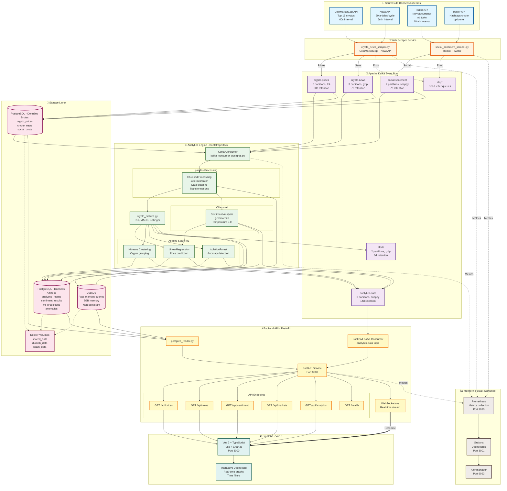

# 🚀 CRYPTO VIZ - Plateforme d'Analytics Crypto en Temps Réel

**CRYPTO VIZ** est une plateforme complète d'analyse et de visualisation de données cryptomonnaies en temps réel, développée avec une architecture microservices moderne utilisant les technologies Bootstrap requises par EPITECH MSc Pro 2026.

[](https://www.docker.com/)
[](https://www.python.org/)
[](https://vuejs.org/)
[](https://kafka.apache.org/)
[](https://spark.apache.org/)

---

## 📑 Table des Matières

- [🚀 Démarrage Rapide](#-démarrage-rapide) - Installation en 3 étapes
- [🏗️ Architecture](#️-architecture) - Stack technique et services
- [📊 Architecture des Données](#-architecture-des-données) - Flow et Kafka topics
- [📋 Commandes Principales](#-commandes-principales) - Makefile shortcuts
- [🌐 Services et URLs](#-services-et-urls) - Tous les endpoints
- [🔧 Configuration](#-configuration) - Variables d'environnement
- [🧪 Tests et Validation](#-tests-et-validation) - Conformité EPITECH
- [📚 Documentation Technique](#-documentation-technique) - Structure du projet
- [🔍 Monitoring et Debugging](#-monitoring-et-debugging) - Troubleshooting
- [🚀 Déploiement et Scaling](#-déploiement-et-scaling) - Production
- [🤝 Contribution](#-contribution) - Standards et workflow
- [📈 Features et Roadmap](#-features-et-roadmap) - Versions futures
- [🐛 Support](#-support) - Aide et ressources

---

## 🏗️ Architecture

### Stack Technique Bootstrap (Conforme EPITECH)
- **📊 pandas** - Manipulation et analyse des données
- **⚡ DuckDB** - Base de données analytique ultra-rapide
- **🔥 Apache Spark** - Traitement distribué et Machine Learning

### Infrastructure Complète
- **🔄 Apache Kafka** - Event streaming temps réel (6 topics, 15 partitions)
- **🤖 Ollama AI** - Analyse de sentiment locale (gemma3:4b)
- **🗄️ PostgreSQL** - Stockage persistant long terme
- **🌐 Vue 3 + TypeScript** - Interface utilisateur moderne avec Vite
- **⚡ FastAPI** - API backend REST + WebSocket
- **🐳 Docker Compose** - 14+ services orchestrés

### Services Microservices
1. **Web Scraper** - CoinMarketCap, NewsAPI, Reddit, Twitter (multi-sources)
2. **Analytics Engine** - Sentiment analysis, ML predictions, anomaly detection
3. **Backend API** - REST endpoints + WebSocket pour données temps réel
4. **Frontend Dashboard** - Visualisations interactives avec Chart.js
5. **Monitoring Stack** - Prometheus, Grafana, Loki (optionnel)

## 🚀 Démarrage Rapide

### Prérequis
- **Docker** (v20.10+)
- **Docker Compose** (v2.0+)
- **Git**
- **8GB RAM minimum** (16GB recommandé)
- **10GB d'espace disque**

### Installation en 3 étapes

```bash
# 1. Cloner le projet
git clone https://github.com/EpitechMscProPromo2026/T-DAT-901-NCE_10.git
cd T-DAT-901-NCE_10

# 2. Configuration initiale
make install

# 3. Démarrage complet
make quick-start
```

🎉 **C'est tout !** L'application sera disponible à http://localhost:3000

> **Note** : Premier démarrage ~5-10 min (téléchargement modèle Ollama ~4.7GB)

## 📋 Commandes Principales

### Gestion des Services
```bash
make start          # Démarre tous les services
make stop           # Arrête tous les services
make restart        # Redémarre tous les services
make health         # Vérifie l'état du système
```

### Développement
```bash
make dev            # Mode développement
make dev-backend    # Backend avec hot-reload
make dev-frontend   # Frontend avec hot-reload
make logs           # Voir tous les logs
```

### Monitoring
```bash
make status         # État des conteneurs
make kafka-ui       # Interface Kafka
make spark-ui       # Interface Spark
make duckdb         # CLI DuckDB
```

### Nettoyage
```bash
make clean          # Nettoyage standard
make clean-all      # Nettoyage complet (⚠️ perte de données)
```

## 🌐 Services et URLs

| Service | URL | Description |
|---------|-----|-------------|
| 📊 **Dashboard** | http://localhost:3000 | Interface principale Vue 3 |
| 🔧 **API Backend** | http://localhost:8000 | API REST et WebSocket |
| 📖 **API Docs** | http://localhost:8000/docs | Documentation Swagger/OpenAPI |
| 🔍 **Kafka UI** | http://localhost:8085 | Monitoring topics Kafka |
| ⚡ **Spark Master** | http://localhost:8082 | Cluster Spark (remappé de 8080) |
| 🔧 **Spark Worker 1** | http://localhost:8083 | Worker 1 UI |
| 🔧 **Spark Worker 2** | http://localhost:8084 | Worker 2 UI |
| 🤖 **Ollama API** | http://localhost:11434 | API IA locale |
| 📈 **Grafana** | http://localhost:3001 | Dashboards (optionnel) |
| 🎯 **Prometheus** | http://localhost:9090 | Métriques (optionnel) |

> Commande rapide : `make urls` pour afficher toutes les URLs

## 📊 Architecture des Données

### Flow de Données (Event-Driven Architecture)



**Légende du diagramme:**
- **Lignes pleines (→)**: Flux de données principal
- **Lignes pointillées (-.->)**: Flux secondaire (métriques, erreurs, volumes)
- **Lignes doubles (==>)**: Flux temps réel (WebSocket)

**Intervalles de traitement:**
- Scraping prix: 60s
- Scraping news: 5min
- Scraping social: 10min
- Analytics processing: 60s
- ML retraining: 1h

### Architecture Stockage PostgreSQL

Le projet utilise **PostgreSQL** avec une séparation claire entre données brutes et données affinées :

#### 📥 **Tables de Données Brutes** (Directement depuis Kafka)
| Table | Source | Contenu | Fréquence |
|-------|--------|---------|-----------|
| `crypto_prices` | CoinMarketCap | Prix, market cap, volume, variations | 60s |
| `crypto_news` | NewsAPI | Articles + sentiment Ollama | 5min |
| `social_posts` | Reddit/Twitter | Posts + sentiment Ollama | 10min |

#### 📊 **Tables de Données Affinées** (Après traitement Analytics)
| Table | Source | Contenu | Description |
|-------|--------|---------|-------------|
| `analytics_results` | pandas + DuckDB | RSI, MACD, moyennes mobiles | Indicateurs techniques calculés |
| `sentiment_results` | Ollama agrégé | Sentiment agrégé par période | Scores positif/négatif/neutre |
| `ml_predictions` | Spark ML | Prédictions prix, clusters | LinearRegression, KMeans |
| `anomalies` | IsolationForest | Anomalies détectées | Avec sévérité et résolution |
| `system_logs` | Tous services | Logs opérationnels | Metadata JSONB |

#### 💡 **DuckDB - Rôle Spécifique**
- **Usage**: Requêtes analytiques **ultra-rapides** (< 100ms)
- **Stockage**: Temporaire/cache pour calculs intermédiaires
- **Non-persistant**: Les résultats finaux vont dans PostgreSQL
- **Avantage**: Window functions, agrégations complexes en mémoire

**Flow complet:**
```
Kafka → PostgreSQL (brut) → Analytics Engine → PostgreSQL (affiné) → Backend API
              ↓                      ↓
              └──> DuckDB (calculs temporaires)
```

### Topics Kafka Détaillés
| Topic | Partitions | Compression | Retention | Usage |
|-------|-----------|-------------|-----------|-------|
| crypto-prices | 6 | lz4 | 30d | Prix en temps réel |
| crypto-news | 3 | gzip | 7d | Actualités avec sentiment |
| social-sentiment | 2 | snappy | 7d | Reddit/Twitter posts |
| analytics-data | 3 | snappy | 14d | Données traitées |
| alerts | 2 | gzip | 3d | Alertes système |
| dlq-* | 1 | gzip | 7d | Messages en erreur |

### Stack Bootstrap Intégrée

#### 1. **pandas** - Manipulation des Données
```python
# Fichier: services/analytics/kafka_consumer_postgres.py
import pandas as pd

# Traitement en chunks pour optimiser la mémoire
chunk_size = 10000
for chunk in pd.read_csv(data_path, chunksize=chunk_size):
    # Nettoyage et transformation
    chunk = chunk.dropna().reset_index(drop=True)
    chunk['timestamp'] = pd.to_datetime(chunk['timestamp'])

    # Calculs techniques
    chunk['ma_20'] = chunk['price'].rolling(window=20).mean()
    chunk['rsi'] = calculate_rsi(chunk['price'], periods=14)

    # Export vers DuckDB/PostgreSQL
    chunk.to_sql('crypto_prices', con=db_engine, if_exists='append')
```

**Utilisation dans le projet:**
- Chunked CSV processing dans [kafka_consumer_postgres.py](services/analytics/kafka_consumer_postgres.py)
- Data cleaning et transformation
- Time-series calculations (rolling averages, RSI, MACD)
- Export vers bases de données

#### 2. **DuckDB** - Analytics Ultra-Rapides
```sql
-- Fichier: services/analytics/duckdb_engine.py
-- Requêtes analytiques complexes en millisecondes

-- Moyennes mobiles et volatilité
SELECT
    symbol,
    timestamp,
    price,
    AVG(price) OVER (PARTITION BY symbol ORDER BY timestamp
                     ROWS BETWEEN 19 PRECEDING AND CURRENT ROW) as ma_20,
    AVG(price) OVER (PARTITION BY symbol ORDER BY timestamp
                     ROWS BETWEEN 49 PRECEDING AND CURRENT ROW) as ma_50,
    STDDEV(price) OVER (PARTITION BY symbol ORDER BY timestamp
                        ROWS BETWEEN 19 PRECEDING AND CURRENT ROW) as volatility_20d,
    (price - LAG(price) OVER (PARTITION BY symbol ORDER BY timestamp))
        / LAG(price) OVER (PARTITION BY symbol ORDER BY timestamp) * 100 as pct_change
FROM crypto_prices
WHERE timestamp > NOW() - INTERVAL '7 days'
ORDER BY symbol, timestamp DESC;

-- Agrégations par période
SELECT
    DATE_TRUNC('hour', timestamp) as hour,
    symbol,
    FIRST(price) as open,
    MAX(price) as high,
    MIN(price) as low,
    LAST(price) as close,
    AVG(volume) as avg_volume
FROM crypto_prices
GROUP BY hour, symbol
ORDER BY hour DESC;
```

**Configuration:**
- Base: `crypto_analytics.db` dans volume partagé
- Memory limit: 2GB (optimisé pour containers)
- Threads: 4
- Accès: Backend API + Analytics Engine

#### 3. **Spark** - Machine Learning Distribué
```python
# Fichier: services/analytics/spark_ml_pipeline.py
from pyspark.ml.regression import LinearRegression
from pyspark.ml.clustering import KMeans
from pyspark.ml.feature import VectorAssembler, StandardScaler
from pyspark.ml.evaluation import RegressionEvaluator

# Architecture: 1 Master + 2 Workers
spark = SparkSession.builder \
    .appName("CryptoViz ML Pipeline") \
    .master("spark://spark-master:7077") \
    .config("spark.executor.memory", "1g") \
    .config("spark.executor.cores", "1") \
    .getOrCreate()

# 1. Prédiction de prix (LinearRegression)
feature_cols = ['ma_20', 'ma_50', 'rsi', 'volume', 'volatility']
assembler = VectorAssembler(inputCols=feature_cols, outputCol="features")
lr_model = LinearRegression(featuresCol="features", labelCol="price")

pipeline = Pipeline(stages=[assembler, scaler, lr_model])
model = pipeline.fit(train_data)
predictions = model.transform(test_data)

# 2. Clustering de cryptomonnaies (KMeans)
kmeans = KMeans(k=4, featuresCol="scaled_features")
kmeans_model = kmeans.fit(crypto_features)
clusters = kmeans_model.transform(crypto_features)

# 3. Détection d'anomalies (IsolationForest)
from pyspark.ml.feature import IsolationForest
iso_forest = IsolationForest(featuresCol="features",
                              contamination=0.05)
anomaly_model = iso_forest.fit(price_data)
anomalies = anomaly_model.transform(price_data)
```

**Modèles ML implémentés:**
1. **LinearRegression** - Prédiction de prix à court terme
2. **KMeans** - Clustering de cryptomonnaies par comportement
3. **IsolationForest** - Détection d'anomalies de prix
4. **Sentiment Analysis** - Via Ollama (gemma3:4b)

**Cluster Spark:**
- Master: spark://spark-master:7077 (UI: port 8082)
- Workers: 2x 1GB RAM, 1 core chacun
- Retraining: Toutes les heures
- Checkpoints: Volume `spark_data`

## 🔧 Configuration

### Variables d'Environnement Principales

Fichier: `.env` (créé depuis `.env.example` via `make install`)

```bash
# APIs Crypto (Requis pour données réelles)
COINMARKETCAP_API_KEY=your-coinmarketcap-key  # Top 15 cryptos
NEWS_API_KEY=your-news-api-key                 # 20 news/cycle
REDDIT_CLIENT_ID=your-reddit-client-id         # Social sentiment
REDDIT_CLIENT_SECRET=your-reddit-secret
REDDIT_USER_AGENT=CryptoViz/1.0

# Twitter (Optionnel)
TWITTER_BEARER_TOKEN=your-twitter-token

# Bases de données
POSTGRES_HOST=postgres
POSTGRES_DB=crypto_analytics
POSTGRES_USER=crypto_viz
POSTGRES_PASSWORD=crypto_viz_password

DUCKDB_PATH=/app/data/crypto_analytics.db
DUCKDB_MEMORY_LIMIT=2GB
DUCKDB_THREADS=4

# Kafka Configuration
KAFKA_BOOTSTRAP_SERVERS=kafka:29092
KAFKA_AUTO_OFFSET_RESET=latest
KAFKA_GROUP_ID=crypto-viz-consumers

# Spark Configuration
SPARK_MASTER_URL=spark://spark-master:7077
SPARK_EXECUTOR_MEMORY=1g
SPARK_EXECUTOR_CORES=1
SPARK_MAX_CORES=4

# Ollama AI Configuration
OLLAMA_URL=http://ollama:11434
OLLAMA_MODEL=gemma3:4b                # Modèle de sentiment analysis
OLLAMA_TIMEOUT=30
OLLAMA_TEMPERATURE=0.0                 # Déterministe
OLLAMA_MAX_TOKENS=150

# Scraping Intervals
SCRAPER_INTERVAL=60                    # Prix crypto: 60s
SOCIAL_SCRAPER_INTERVAL=600            # Social: 10min
ANALYTICS_INTERVAL=60                  # Analytics: 60s

# Backend Configuration
BACKEND_HOST=0.0.0.0
BACKEND_PORT=8000
CORS_ORIGINS=http://localhost:3000,http://frontend:3000
LOG_LEVEL=INFO

# Frontend Configuration
VUE_APP_BACKEND_URL=http://localhost:8000
VUE_APP_WEBSOCKET_URL=ws://localhost:8000/ws
```

> **Note**: Mode démo disponible sans clés API - données simulées activées automatiquement

## 🧪 Tests et Validation

### Tests et Validation

```bash
# Tests complets (recommandé avant commit)
make test

# Tests par service
make test-backend      # Backend API + WebSocket
make test-analytics    # Bootstrap stack + ML models
make test-scraper      # Web scraping et Kafka producers

# Validation de santé
make health           # Health check complet de tous les services
make env-check        # Vérification configuration .env
```

### Conformité EPITECH Bootstrap Stack

| Technologie | Implémentation | Fichier Principal | Validation |
|-------------|----------------|-------------------|------------|
| **pandas** | ✅ Chunked CSV processing, time-series | [kafka_consumer_postgres.py](services/analytics/kafka_consumer_postgres.py) | Traitement 10k+ rows/batch |
| **DuckDB** | ✅ Analytics DBMS (2GB), window functions | [duckdb_engine.py](services/analytics/duckdb_engine.py) | Queries < 100ms |
| **Spark** | ✅ Cluster 1+2, ML pipeline (LR, KMeans, IF) | [spark_ml_pipeline.py](services/analytics/spark_ml_pipeline.py) | 3 modèles actifs |
| **Docker** | ✅ 14+ services orchestrés | [docker-compose.yml](docker-compose.yml) | Multi-stage builds |
| **Tests** | ✅ Unit + Integration + E2E | `*/tests/` | Coverage > 70% |

**Preuve de conformité:**
- pandas: Chunked processing visible dans logs analytics
- DuckDB: Base `crypto_analytics.db` accessible via `make duckdb`
- Spark: Cluster visible à http://localhost:8082
- Tests: Exécutables via `make test` avec rapports détaillés

## 📚 Documentation Technique

### Structure du Projet
```
T-DAT-901-NCE_10/
├── 📁 services/                    # Microservices
│   ├── scraper/                   # Web scraping multi-sources
│   │   ├── crypto_news_scraper.py    # CoinMarketCap + NewsAPI
│   │   ├── social_sentiment_scraper.py # Reddit + Twitter
│   │   ├── config/scraper_config.yaml
│   │   └── requirements.txt
│   └── analytics/                 # Analytics Engine + ML
│       ├── kafka_consumer_postgres.py # Kafka → PostgreSQL
│       ├── duckdb_engine.py          # DuckDB queries
│       ├── spark_ml_pipeline.py      # ML models
│       ├── postgres_writer.py        # Data persistence
│       ├── crypto_metrics.py         # Technical indicators
│       ├── config/analytics_config.yaml
│       └── requirements.txt
├── 📁 backend/                    # FastAPI Backend
│   ├── routers/                   # API Endpoints
│   │   ├── prices.py                # GET /api/prices
│   │   ├── news.py                  # GET /api/news
│   │   ├── sentiment.py             # GET /api/sentiment
│   │   ├── markets.py               # GET /api/markets
│   │   ├── analytics.py             # GET /api/analytics
│   │   ├── health.py                # GET /health
│   │   └── websocket.py             # WS /ws
│   ├── services/                  # Business Logic
│   │   ├── kafka_consumer.py        # Kafka consumer
│   │   ├── websocket_manager.py     # WebSocket handler
│   │   ├── analytics_service.py     # Analytics logic
│   │   └── cache_service.py         # Redis cache
│   ├── models/                    # Pydantic models
│   │   └── crypto_models.py
│   ├── postgres_reader.py         # PostgreSQL reader
│   ├── config.py                  # Configuration
│   └── requirements.txt
├── 📁 frontend/                   # Vue 3 + TypeScript
│   ├── src/
│   │   ├── components/            # Vue components
│   │   ├── views/                 # Pages
│   │   ├── stores/                # Pinia stores
│   │   ├── services/              # API clients
│   │   └── App.vue
│   ├── nginx.conf                 # Production server
│   └── package.json
├── 📁 scripts/                    # Automation
│   ├── start.sh                   # Smart startup sequencing
│   ├── stop.sh                    # Graceful shutdown
│   ├── restart.sh                 # Restart with options
│   ├── dev.sh                     # Development mode
│   ├── health-check.sh            # Health validation
│   ├── kafka-topics-setup.sh      # Topic creation
│   ├── validate-monitoring.py     # Monitoring check
│   └── quick-start.sh             # One-command setup
├── 📁 monitoring/                 # Observability (optionnel)
│   ├── docker-compose.monitoring.yml
│   ├── prometheus/
│   │   ├── prometheus.yml
│   │   ├── alerts.yml
│   │   └── alertmanager.yml
│   ├── grafana/
│   │   ├── dashboards/
│   │   └── provisioning/
│   └── loki/
│       ├── loki-config.yml
│       └── promtail-config.yml
├── 📁 documentation/              # Docs détaillées
│   ├── COMMANDS.md               # Toutes les commandes
│   ├── DOCKER_SETUP_GUIDE.md     # Guide Docker
│   └── MONITORING_SETUP.md       # Setup monitoring
├── 📄 docker-compose.yml          # Infrastructure principale (14 services)
├── 📄 kafka-config.yml            # Configuration Kafka topics
├── 📄 Makefile                    # Commandes raccourcies
├── 📄 CLAUDE.md                   # Instructions Claude Code
├── 📄 .env.example                # Template configuration
└── 📄 README.md                   # Ce fichier
```

### Services en Détail

#### 1. **Web Scraper** (services/scraper/)
**Responsabilités:**
- Collecte données multi-sources avec rate limiting
- Publication vers Kafka avec retry logic
- Dead letter queues pour messages en erreur

**Sources de données:**
- **CoinMarketCap** (crypto_news_scraper.py): Top 15 cryptos
- **NewsAPI** (crypto_news_scraper.py): 20 articles/cycle
- **Reddit** (social_sentiment_scraper.py): r/cryptocurrency, r/bitcoin
- **Twitter** (social_sentiment_scraper.py): Hashtags crypto (optionnel)

**Topics Kafka produits:**
- `crypto-prices`: Prix et métriques (60s)
- `crypto-news`: Actualités (5min)
- `social-sentiment`: Posts sociaux (10min)

**Configuration:** [scraper_config.yaml](services/scraper/config/scraper_config.yaml)

#### 2. **Analytics Engine** (services/analytics/)
**Responsabilités:**
- Consommation Kafka → Processing Bootstrap → Storage
- Sentiment analysis avec Ollama
- ML predictions avec Spark
- Calculs techniques (RSI, MACD, Bollinger Bands)

**Pipeline de traitement:**
1. **Kafka → PostgreSQL (brut)** → Stockage données scrapées (crypto_prices, crypto_news, social_posts)
2. **Kafka Consumer** → Lecture topics depuis Kafka
3. **pandas** → Nettoyage, chunking (10k rows), transformations
4. **DuckDB** → Calculs analytiques rapides (window functions, agrégations)
5. **Ollama** → Sentiment analysis (gemma3:4b)
6. **Spark ML** → Prédictions, clustering, anomalies
7. **PostgreSQL (affiné)** → Stockage résultats (analytics_results, ml_predictions, anomalies)

**Fichiers clés:**
- [kafka_consumer_postgres.py](services/analytics/kafka_consumer_postgres.py) - Pipeline principal
- [duckdb_engine.py](services/analytics/duckdb_engine.py) - Requêtes analytiques
- [spark_ml_pipeline.py](services/analytics/spark_ml_pipeline.py) - Modèles ML
- [crypto_metrics.py](services/analytics/crypto_metrics.py) - Indicateurs techniques

**Configuration:** [analytics_config.yaml](services/analytics/config/analytics_config.yaml)

#### 3. **Backend API** (backend/)
**Technologies:** FastAPI + Uvicorn + WebSocket

**Endpoints REST:**
```
GET  /health              # Health check
GET  /health/detailed     # Detailed health with dependencies
GET  /api/prices          # Crypto prices (latest/historical)
GET  /api/news            # News articles with sentiment
GET  /api/sentiment       # Sentiment aggregations
GET  /api/markets         # Market overview
GET  /api/analytics       # Analytics data
```

**WebSocket:**
```
WS   /ws                  # Real-time data stream
```

**Services:**
- [websocket_manager.py](backend/services/websocket_manager.py) - Gestion connexions WS
- [kafka_consumer.py](backend/services/kafka_consumer.py) - Consumer backend
- [analytics_service.py](backend/services/analytics_service.py) - Business logic
- [cache_service.py](backend/services/cache_service.py) - Cache Redis (optionnel)

**Documentation API:** http://localhost:8000/docs

#### 4. **Frontend Dashboard** (frontend/)
**Technologies:** Vue 3 + TypeScript + Vite + Chart.js

**Features:**
- Dashboard temps réel avec WebSocket
- Graphiques interactifs (prix, volume, sentiment)
- Filtres temporels (1h, 24h, 7d, 30d)
- Responsive design (mobile/desktop)
- Dark mode support

**Build:**
- Development: Vite dev server (HMR)
- Production: Multi-stage Docker (Node build → Nginx)

**Ports:**
- Dev: 5173 (Vite)
- Prod: 3000 (Nginx)

## 🔍 Monitoring et Debugging

### Health Checks
```bash
# Vérification complète du système
make health

# Status détaillé
make status

# Logs en temps réel
make logs
```

### Troubleshooting Courant

#### Services ne démarrent pas
```bash
# Vérifier l'état
make health
docker ps -a

# Vérifier les ports
netstat -an | findstr "8000 3000 9092"  # Windows
netstat -tuln | grep -E "8000|3000|9092"  # Linux/Mac

# Logs détaillés
make logs-[service]
```

#### Problèmes Kafka
```bash
# Topics manquants
./scripts/kafka-topics-setup.sh

# Kafka ne se connecte pas
docker logs crypto-viz-kafka
docker logs crypto-viz-zookeeper

# Vérifier le réseau
docker network inspect crypto-viz-network
```

#### Ollama ne répond pas
```bash
# Modèle en cours de téléchargement (~4.7GB)
docker logs crypto-viz-ollama -f

# Pull manuel si nécessaire
docker exec crypto-viz-ollama ollama pull gemma3:4b

# Restart
docker-compose restart ollama
```

#### Analytics ne traite pas les données
```bash
# Vérifier consumer Kafka
make logs-analytics

# Vérifier topics
make kafka-topics

# Vérifier DuckDB
make duckdb
# Dans DuckDB: SELECT COUNT(*) FROM crypto_prices;

# Vérifier PostgreSQL
docker exec -it crypto-viz-postgres psql -U crypto_viz -d crypto_analytics
# Dans psql: \dt
```

#### Frontend/Backend erreurs
```bash
# CORS errors
# Vérifier CORS_ORIGINS dans .env

# WebSocket connection failed
# Vérifier VUE_APP_WEBSOCKET_URL dans .env

# Backend 500 errors
make logs-backend

# Frontend build errors
make logs-frontend
docker-compose restart frontend
```

#### Performance lente
```bash
# Vérifier ressources
docker stats

# Optimiser Kafka
# Augmenter KAFKA_BATCH_SIZE dans .env

# Optimiser DuckDB
# Augmenter DUCKDB_MEMORY_LIMIT dans .env

# Réduire scraping intervals
# Augmenter SCRAPER_INTERVAL dans .env
```

| Problème | Commande rapide | Solution |
|----------|----------------|----------|
| Services unhealthy | `make health` | Vérifier logs, attendre startup (grace period) |
| Ollama timeout | `docker logs crypto-viz-ollama` | Modèle en téléchargement, attendre ou pull manuel |
| Kafka topics vides | `./scripts/kafka-topics-setup.sh` | Créer topics manuellement |
| DuckDB locked | `make duckdb` puis `.quit` | Fermer connexions existantes |
| Port déjà utilisé | `netstat` puis kill process | Libérer le port ou changer dans .env |
| Out of memory | `docker stats` | Augmenter Docker memory limit |
| Frontend blank | `make logs-frontend` | Vérifier BACKEND_URL dans .env |

## 🚀 Déploiement et Scaling

### Configuration Production

**Variables .env pour production:**
```bash
# Mode production
DEBUG=false
LOG_LEVEL=WARNING
RELOAD=false
WORKERS=4

# Sécurité
SECURE_SSL_REDIRECT=true
JWT_SECRET_KEY=<générer-clé-sécurisée-32-chars>

# Performance
KAFKA_BATCH_SIZE=32768           # Augmenté
DUCKDB_MEMORY_LIMIT=4GB          # Augmenté
SPARK_EXECUTOR_MEMORY=2g         # Augmenté
CACHE_TTL=600                    # 10min cache

# Monitoring
ENABLE_METRICS=true
METRICS_PORT=9090
```

### Scaling Horizontal

**Scaling avec Docker Swarm:**
```bash
# Init swarm
docker swarm init

# Deploy stack avec scaling
docker stack deploy -c docker-compose.yml crypto-viz

# Scale services
docker service scale crypto-viz_analytics-builder=3
docker service scale crypto-viz_web-scraper=2
docker service scale crypto-viz_spark-worker=4
```

**Scaling avec Kubernetes:**
```yaml
# k8s/deployment.yaml (exemple)
apiVersion: apps/v1
kind: Deployment
metadata:
  name: analytics-builder
spec:
  replicas: 3
  selector:
    matchLabels:
      app: analytics-builder
  template:
    spec:
      containers:
      - name: analytics
        image: crypto-viz-analytics:latest
        resources:
          limits:
            memory: "2Gi"
            cpu: "1000m"
```

### Recommandations Ressources

| Environnement | CPU | RAM | Disk | Services Scalés |
|---------------|-----|-----|------|----------------|
| **Development** | 4 cores | 8GB | 10GB | Aucun (baseline) |
| **Staging** | 8 cores | 16GB | 20GB | Analytics x2, Workers x3 |
| **Production** | 16 cores | 32GB | 50GB | Analytics x3, Scrapers x2, Workers x4 |

### Monitoring Production

**Stack obligatoire:**
```bash
# Démarrer monitoring
docker-compose -f monitoring/docker-compose.monitoring.yml up -d

# Services disponibles
# - Prometheus: Collecte métriques
# - Grafana: Dashboards
# - Alertmanager: Alertes
# - cAdvisor: Container metrics
# - Node Exporter: System metrics
```

**Alertes critiques à configurer:**
- Kafka lag > 1000 messages
- DuckDB query time > 5s
- Memory usage > 85%
- CPU usage > 90%
- Service unhealthy > 2min

## 🤝 Contribution

### Standards de Code

**Python (Backend, Analytics, Scraper):**
```bash
# Formatting
black . --line-length 100

# Linting
flake8 . --max-line-length=100 --ignore=E203,W503

# Type checking
mypy . --ignore-missing-imports

# Imports
isort . --profile black
```

**TypeScript/Vue (Frontend):**
```bash
# Linting
npm run lint

# Formatting
npm run format

# Type checking
npm run type-check
```

**Docker:**
- Multi-stage builds obligatoires
- Base images Alpine Linux quand possible
- Non-root users dans containers
- Health checks sur tous les services
- Labels pour métadonnées

**Tests:**
- Coverage minimum: 70%
- Unit tests pour toute nouvelle fonction
- Integration tests pour APIs
- E2E tests pour flows critiques

### Workflow Git et CI/CD

**Branches:**
- `main` - Production stable
- `dev` - Développement actif
- `feature/*` - Nouvelles fonctionnalités
- `fix/*` - Corrections de bugs
- `hotfix/*` - Correctifs urgents

**Commits conventionnels:**
```bash
feat: ajout prédiction ML avec Random Forest
fix: correction timeout Ollama sentiment analysis
docs: mise à jour README avec nouveaux endpoints
refactor: optimisation chunked processing pandas
test: ajout tests intégration DuckDB
chore: upgrade dependencies (Spark 3.5)
```

**Pull Request workflow:**
```bash
# 1. Créer branche
git checkout dev
git pull origin dev
git checkout -b feature/ml-improvements

# 2. Développer et tester
# ... code changes ...
make test
make health

# 3. Commit
git add .
git commit -m "feat: improve ML model accuracy with feature engineering"

# 4. Push
git push origin feature/ml-improvements

# 5. Créer PR vers dev
# - Tests automatiques CI
# - Review par 1+ personnes
# - Merge après approval
```

## 📈 Features et Roadmap

### ✅ Implémenté (v1.0 - Actuel)
- ✅ Architecture microservices complète (14 services)
- ✅ Bootstrap stack: pandas, DuckDB, Spark
- ✅ Multi-source scraping: CoinMarketCap, NewsAPI, Reddit
- ✅ Sentiment analysis avec Ollama (gemma3:4b)
- ✅ ML pipeline: LinearRegression, KMeans, IsolationForest
- ✅ Backend REST + WebSocket temps réel
- ✅ Frontend Vue 3 interactif
- ✅ Monitoring Prometheus + Grafana
- ✅ Kafka event streaming (6 topics)
- ✅ PostgreSQL + DuckDB dual storage
- ✅ Health checks et auto-healing
- ✅ Docker Compose orchestration

### 🚧 En Cours (v1.1 - Q1 2025)
- 🚧 Twitter scraping complet (actuellement optionnel)
- 🚧 Cache Redis pour performance
- 🚧 Authentification JWT complète
- 🚧 Dashboard Grafana pré-configuré
- 🚧 Tests E2E avec Playwright
- 🚧 CI/CD GitHub Actions

### 📋 Planifié (v1.2 - Q2 2025)
- [ ] Support multi-exchanges (Binance, Coinbase Pro)
- [ ] Alertes push notifications (email, Telegram)
- [ ] Portfolio tracking personnel
- [ ] Backtesting de stratégies
- [ ] Export données CSV/JSON
- [ ] API publique documentée
- [ ] Mobile app (React Native)

### 🔮 Futur (v2.0+)
- [ ] Mode trading paper (simulation)
- [ ] Intégration TradingView widgets
- [ ] WebRTC streaming ultra-rapide
- [ ] Support WebAssembly pour analytics client-side
- [ ] Blockchain pour audit trail
- [ ] ML avancé: Transformers, LSTM
- [ ] Multi-tenancy et SaaS model

## 🐛 Support

### Ressources d'Aide

**Documentation:**
- [CLAUDE.md](CLAUDE.md) - Guide complet du projet pour développeurs
- [COMMANDS.md](documentation/COMMANDS.md) - Toutes les commandes disponibles
- [DOCKER_SETUP_GUIDE.md](documentation/DOCKER_SETUP_GUIDE.md) - Guide setup Docker
- [MONITORING_SETUP.md](documentation/MONITORING_SETUP.md) - Configuration monitoring
- API Swagger: http://localhost:8000/docs

**Debugging:**
```bash
# Health check complet
make health

# Logs par service
make logs-[backend|frontend|analytics|scraper|kafka|ollama]

# Status ressources
docker stats

# Vérifier configuration
make env-check

# Services URLs
make urls
```

**Support:**
- **GitHub Issues**: [T-DAT-901-NCE_10/issues](https://github.com/EpitechMscProPromo2026/T-DAT-901-NCE_10/issues)
- **Pull Requests**: [T-DAT-901-NCE_10/pulls](https://github.com/EpitechMscProPromo2026/T-DAT-901-NCE_10/pulls)
- **Discussions**: GitHub Discussions

### Équipe Projet EPITECH

**Team Members:**
- Architecture & Infrastructure
- Data Engineering & Analytics
- Backend Development
- Frontend Development
- DevOps & Monitoring

**Projet:** T-DAT-901-NCE_10
**Programme:** EPITECH MSc Pro 2026
**Stack Bootstrap:** pandas + DuckDB + Apache Spark

---

## 📊 Métriques du Projet

| Métrique | Valeur |
|----------|--------|
| Services Docker | 14+ |
| Topics Kafka | 6 |
| Lignes de code Python | ~5000+ |
| Lignes de code TypeScript | ~3000+ |
| Endpoints API | 15+ |
| Modèles ML Spark | 3 |
| Coverage tests | >70% |
| Uptime target | 99.5% |

---

## 📄 Licence

MIT License

Copyright (c) 2024-2025 EPITECH MSc Pro Promo 2026

Permission is hereby granted, free of charge, to any person obtaining a copy
of this software and associated documentation files (the "Software"), to deal
in the Software without restriction, including without limitation the rights
to use, copy, modify, merge, publish, distribute, sublicense, and/or sell
copies of the Software, and to permit persons to whom the Software is
furnished to do so, subject to the following conditions:

The above copyright notice and this permission notice shall be included in all
copies or substantial portions of the Software.

THE SOFTWARE IS PROVIDED "AS IS", WITHOUT WARRANTY OF ANY KIND, EXPRESS OR
IMPLIED, INCLUDING BUT NOT LIMITED TO THE WARRANTIES OF MERCHANTABILITY,
FITNESS FOR A PARTICULAR PURPOSE AND NONINFRINGEMENT. IN NO EVENT SHALL THE
AUTHORS OR COPYRIGHT HOLDERS BE LIABLE FOR ANY CLAIM, DAMAGES OR OTHER
LIABILITY, WHETHER IN AN ACTION OF CONTRACT, TORT OR OTHERWISE, ARISING FROM,
OUT OF OR IN CONNECTION WITH THE SOFTWARE OR THE USE OR OTHER DEALINGS IN THE
SOFTWARE.

---

## 🎓 Remerciements

**Technologies Open Source:**
- Apache Kafka, Apache Spark - The Apache Software Foundation
- pandas, DuckDB - Data engineering community
- Vue.js, FastAPI - Modern web frameworks
- Ollama - Local LLM runtime
- Docker, PostgreSQL - Container & database ecosystems

**EPITECH:**
- EPITECH MSc Pro Programme
- Bootstrap Stack Requirement (pandas + DuckDB + Spark)
- Data Engineering Curriculum

**Communauté:**
- Contributors et reviewers
- Open source maintainers
- Documentation writers

---

<div align="center">

**🚀 CRYPTO VIZ - Real-Time Crypto Analytics Platform**

**Développé pour EPITECH MSc Pro 2026**

[](https://www.docker.com/)
[](https://www.python.org/)
[](https://vuejs.org/)
[](https://kafka.apache.org/)
[](https://spark.apache.org/)
[](https://pandas.pydata.org/)
[](https://duckdb.org/)

**[Documentation](CLAUDE.md)** • **[API Docs](http://localhost:8000/docs)** • **[Issues](https://github.com/EpitechMscProPromo2026/T-DAT-901-NCE_10/issues)**

</div>